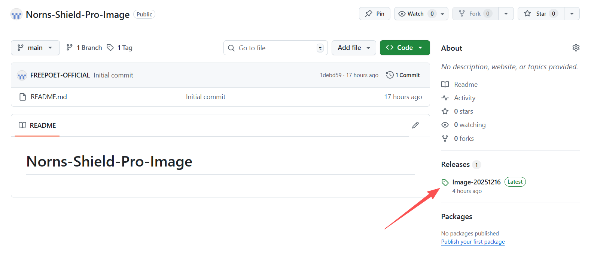
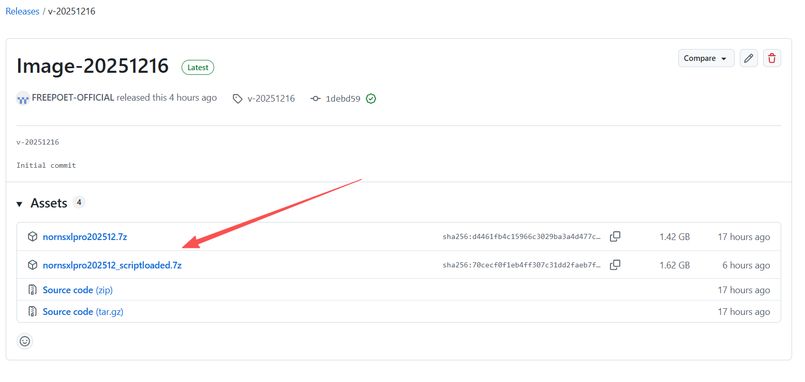
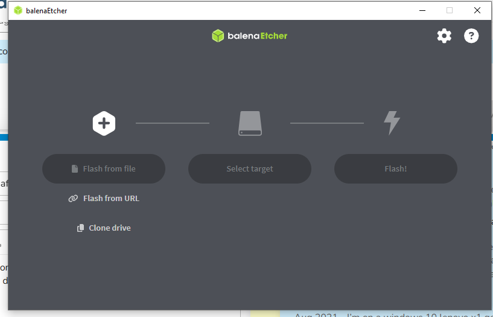

# Norns-Shield-Pro Image
## Image Flashing Guide

Step 1: Download the image from the Releases page
Here you’ll find:

There are two variants: one without scripts and one with scripts. Choose the version you need.

Step 2: Unzip the .7z file
Because the image is large, we’ve compressed it into a .7z archive. Please extract it before flashing.

Step 3: Download BalenaEtcher
BalenaEtcher is a tool for flashing image files to SD cards. If you haven’t installed it yet, visit https://etcher.balena.io/ to download it.

Step 4: Flash the image using BalenaEtcher

- Click "Flash from file" and select the image you extracted from the .7z archive.
- Insert your SD card into a card reader and connect it to your computer.
- Select your SD card as the target.
- Click "Flash".

If you encounter any issues, please email info@freepoet.co.uk.
